# Adam Unity Character Controller

> An early Unity prototype exploring articulated character control through touch and language — one of the earliest foundations behind [Adam](https://adam10.com), our ongoing exploration into interactive characters and physical intelligence.
> 
Play Adam [adam10.com/app](https://adam10.com/app)

Read the full project write-up: [adam10.com/introducing-adam-10](https://adam10.com/introducing-adam-10)

---

## Walking Adam Behavior Experiment

<video src="docs/media/adam-walking-behavior-console.mp4" controls="controls" width="100%"></video>

This experiment shows Adam's articulated **WALK** behavior running in Unity through the behavior console. The console presents the robot definition, joint targets, measured simulation state, foot-contact state, and the active walking phase.

The intended architecture is one robot definition and behavior contract that can run across Unity, MuJoCo, Isaac, and eventually physical Adam. Unity is the runtime shown here; MuJoCo, Isaac, and physical hardware remain future work. This entry documents an experiment in the Unity project, not a claim that walking is live in the browser app or on hardware.

---

<!-- BANNER IMAGE -->
<!-- Replace with project banner:  -->

---

## Preview

<table>
<tbody>
<tr>
<td width="33%"><sub>PROTOTYPE 01</sub></td>
<td width="33%"><sub>PROTOTYPE 02</sub></td>
<td width="33%"><sub>PROTOTYPE 03</sub></td>
</tr>
<tr>
<td valign="top"><a href="docs/media/prototypes/adam-earliest-demo.mp4" title="Open Prototype 01 video">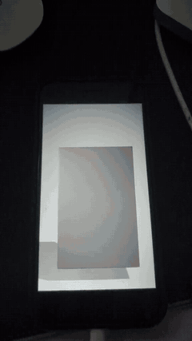</a></td>
<td valign="top">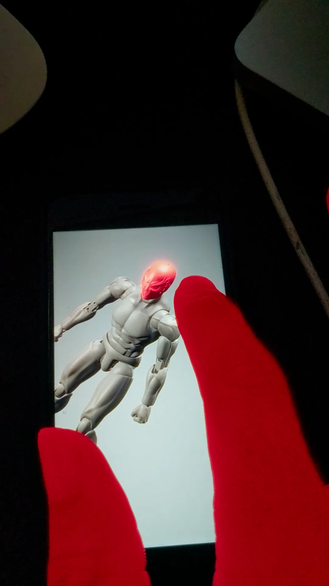</td>
<td valign="top">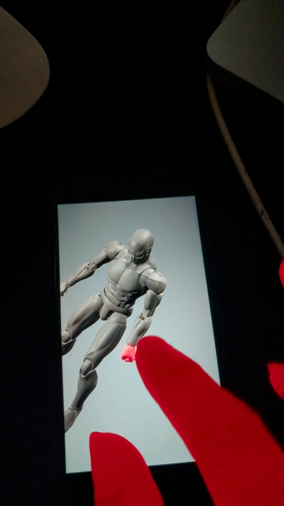</td>
</tr>
<tr>
<td valign="top"><strong>Figure 1.</strong> First touch tests. Tap a body part, and it answers. The first hint that a figure could respond instead of just play back.</td>
<td valign="top"><strong>Figure 2.</strong> Head tests. Each part listens on its own — the way a puppet does, except nothing is pulling the strings but you.</td>
<td valign="top"><strong>Figure 3.</strong> Hand tests. Motion built piece by piece — the same way an animator builds a performance.</td>
</tr>
</tbody>
</table>

<table>
<tbody>
<tr>
<td><a href="docs/media/prototypes/unity-touch.mp4" title="Open the earlier Unity prototype video">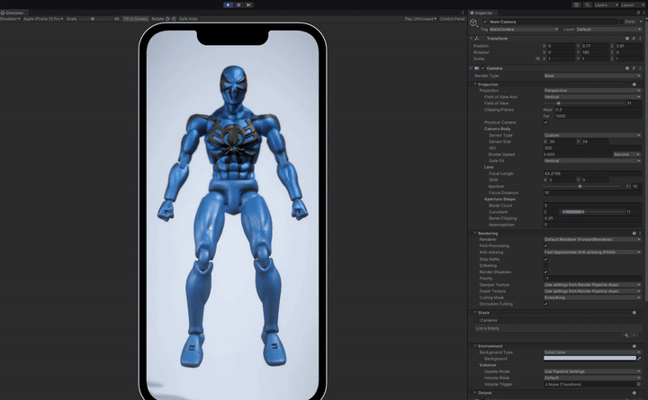</a></td>
</tr>
<tr>
<td><strong>Figure 4.</strong> An early Unity prototype exploring touch control. Tap the figure and it responds — limited range, but the core loop was working. Everything since has been teaching it to perform.</td>
</tr>
</tbody>
</table>

---

## Overview

Adam Unity Character Controller is a research prototype built to explore how an articulated 3D character can be controlled through direct touch and natural language input. It reflects an early stage of Adam's development and contains prototype systems, workflows, and design decisions that helped shape later versions.

This release is shared for **educational purposes**, experimentation, and community exploration.

---

<!-- DEMO GIF OR VIDEO PREVIEW -->
<!-- Replace with demo:  -->

---

## This GitHub Release

This repository contains the **touch-only prototype** — the foundation of Adam's control system as it existed in early development.

**What is not included:**
- AI reasoning or LLM-based command routing
- Voice input or speech-to-text
- Text / chat command interface

**Only touch interaction is supported in this release.** The full Adam 1.0 system — including voice commands, AI-powered intent routing, and the complete language interface described in the [case study](https://adam10.com/adam-case-study) — is not part of this open release.

> **Want to build with us?** Reach out at [steve@adam10.com](mailto:steve@adam10.com)
>
> **See the final product:** [adam10.com](https://adam10.com)

---

## What's Included

| Component | Description |
|---|---|
| Unity Project Files | Complete project, ready to open |
| Character Controller | Touch-driven articulated character system |
| Touch Interaction Prototype | Early finger-tracking and body-contact input |
| Animation & Articulation Setup | Rigged character with layered animation |
| Sample Scene | Fully lit and rendered reference scene |
| Project Structure & Reference Files | Documented layout for exploration |
| Video Tutorials | Coming soon |

---

## Getting Started

### Requirements

- Unity **2021.3 LTS** or later (URP)
- The **Assets** folder (distributed separately — see below)
- The **Builds** folder (distributed separately — see below)

### Installation

**1. Clone this repository**

```bash
git clone https://github.com/stevedatelier/adam-unity-character-controller.git
```

**2. Download the Assets and Builds folders**

The character models, textures, scene assets, and packaged builds are distributed separately due to file size. Download both folders:

> **[Download Assets from Google Drive](https://drive.google.com/file/d/1PnJHzkMkbpozL_xgN_JlF1zIBCjqvY33/view?usp=sharing)**
>
> **[Download Builds from Google Drive](https://drive.google.com/file/d/1j7BIXDN-DRP7D_XdoIWM8vhnfBULj52D/view?usp=sharing)**

To run the Windows build, download the ZIP from the build link above and extract the entire ZIP before opening the application. Keep `Final_Toy.exe`, the `Final_Toy_Data` folder, `UnityPlayer.dll`, and all other generated build files together. In the extracted build folder, double-click the actual `Final_Toy.exe` application, not a shortcut.

After downloading and extracting them, place both `Assets/` and `Builds/` in the root of the cloned repository. Your folder structure should look like this:

```
adam-unity-character-controller/
├── Assets/          ← place downloaded folder here
├── Builds/          ← place downloaded folder here
├── Packages/
├── ProjectSettings/
└── README.md
```

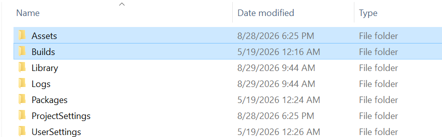

**3. Open in Unity**

Open the project folder in Unity Hub. Allow Unity to import and compile on first launch.

---

<!-- SCENE SCREENSHOT -->
<!-- Replace with Unity scene screenshot:  -->

---

<!-- INSPECTOR / CONTROLLER SCREENSHOT -->
<!-- Replace with inspector screenshot:  -->

---

## Project Structure

```
Assets/
├── Characters/          # Character mesh, FBX, and animations
├── ExampleAssets/       # Materials, props, and environment pieces
├── Editor/              # Custom editor tooling
└── ...

ProjectSettings/         # Unity project configuration (URP, physics, input)
Packages/                # Package manifest and lock file
Builds/                  # Packaged application builds
```

---

## Credits

- Character model by **3DZipGuy**
- Additional assets belong to their respective owners and are used solely for demonstration purposes

---

## About Adam

The current release, **Adam 1.0**, is an AI-powered interactive character that can be controlled through touch, voice commands, and chat in real time.

To experience the latest version: [adam10.com](https://adam10.com)

---

<p align="center"><strong><strong>ANIMATION RIGGING</strong></strong></p>

### Animation Rigging in Unity

<p align="center"><strong><strong>Make Your Robot Interactive. Prep It for AI.</strong></strong></p>

<p align="center"><em><em>A project-specific tutorial for Unity_Adam_Studio.unity</em></em></p>

<p align="center">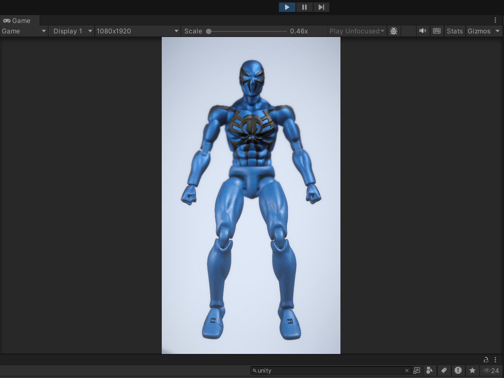</p>

<p align="center"><em>The robot in the portrait Game view. This screenshot is reused in context in Section 3.</em></p>

<p><br></p>

#### How to use this guide

<p>Follow the numbered procedures in order when opening or replacing the character. Sections labeled Project-confirmed come from serialized project files and supplied screenshots. Video-workflow sections adapt the referenced Brackeys demonstration without copying its wording. Unconfirmed items are called out explicitly.</p>

<blockquote>
<p><strong>PROJECT-CONFIRMED  </strong>The analysis was read-only. No Unity scene, prefab, script, package, or project-setting file was changed.</p>
</blockquote>

##### Verified project facts

<table>
<tbody>
<tr>
<th width="26%">
<p><strong>Item</strong></p>
</th>
<th width="74%">
<p><strong>Confirmed value</strong></p>
</th>
</tr>
<tr>
<td width="26%">
<p><strong>Unity Editor</strong></p>
</td>
<td width="74%">
<p>2022.3.62f1 (revision 4af31df58517)</p>
</td>
</tr>
<tr>
<td width="26%">
<p><strong>Project folder</strong></p>
</td>
<td width="74%">
<p>FINAL_TOY_Mobile_V2 - WebGL</p>
</td>
</tr>
<tr>
<td width="26%">
<p><strong>Current scene name</strong></p>
</td>
<td width="74%">
<p>Assets/Scenes/Unity_Adam_Studio.unity (owner-confirmed rename)</p>
</td>
</tr>
<tr>
<td width="26%">
<p><strong>Animation Rigging package</strong></p>
</td>
<td width="74%">
<p>com.unity.animation.rigging 1.2.1</p>
</td>
</tr>
<tr>
<td width="26%">
<p><strong>Render pipeline</strong></p>
</td>
<td width="74%">
<p>Universal Render Pipeline 14.0.12</p>
</td>
</tr>
<tr>
<td width="26%">
<p><strong>Input mode</strong></p>
</td>
<td width="74%">
<p>Legacy Input Manager (activeInputHandler: 0)</p>
</td>
</tr>
<tr>
<td width="26%">
<p><strong>Character model source</strong></p>
</td>
<td width="74%">
<p>Assets/Characters/action.fbx; Generic rig import; Optimize Game Objects off</p>
</td>
</tr>
<tr>
<td width="26%">
<p><strong>Animator state</strong></p>
</td>
<td width="74%">
<p>Enabled; no Avatar and no Runtime Animator Controller assigned</p>
</td>
</tr>
</tbody>
</table>

#### 1. Download and open the project

<blockquote>
<p><strong>NOT CONFIRMED  </strong>No repository URL, release page, or project README is present in the supplied workspace, so the original download source cannot be verified. Use the link or archive supplied by the project owner; do not substitute an unrelated repository.</p>
</blockquote>

<blockquote>
<p><strong>SCENE RENAME  </strong>The project owner confirms that Unity_Cardboard_Studio was renamed Unity_Adam_Studio. The inspected workspace snapshot still contains the earlier filename and Build Settings entry, so this tutorial uses the new owner-confirmed name while preserving the earlier filename in the evidence note at the end.</p>
</blockquote>

<ol>
<li>Download the project from the owner-provided source. If it arrives as a ZIP, extract it completely before opening Unity.</li>
<li>Install Unity Hub, then install Unity Editor 2022.3.62f1. Add WebGL Build Support only if you plan to make a browser build.</li>
<li>In Unity Hub, choose Add project from disk and select the folder FINAL_TOY_Mobile_V2 - WebGL. Select the folder that contains Assets, Packages, and ProjectSettings—not Assets itself.</li>
<li>Allow the first import to finish. Keep the existing Packages/manifest.json intact so Animation Rigging 1.2.1 and URP 14.0.12 resolve as authored.</li>
<li>Open Assets/Scenes/Unity_Adam_Studio.unity. Confirm that this renamed scene is enabled in File &gt; Build Settings before making a new build.</li>
</ol>

<table>
<tbody>
<tr>
<td width="51%">
<p align="center">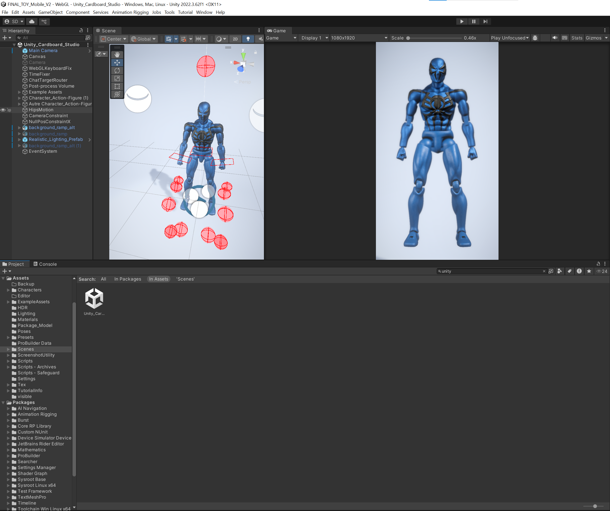</p>
<p><em><em>Figure 1. The correct scene is open, with Main Camera and Character_Action-Figure (1) visible in the Hierarchy.</em></em></p>
</td>
<td width="49%">
<p><strong>Open the correct scene</strong></p>
<p>1. In Project, open Assets &gt; Scenes.</p>
<p>2. Double-click Unity_Adam_Studio.</p>
<p>3. Confirm the Hierarchy header also says Unity_Adam_Studio. The supplied screenshot was captured before the rename, so it may display the earlier scene name.</p>
</td>
</tr>
</tbody>
</table>

##### Run the packaged application without opening Unity

<p>The completed Windows build runs without Unity Hub or the Unity Editor. Download and extract it as described below.</p>

<table>
<tbody>
<tr>
<td width="51%">
<p align="center">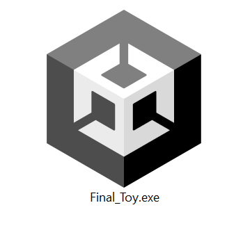</p>
<p><em><em>Launch screenshot A. Run Final_Toy.exe directly without opening the Unity Editor.</em></em></p>
</td>
<td width="49%">
<p><strong>Launch the finished application</strong></p>
<p>1. Download the Windows build ZIP from the <a href="https://drive.google.com/file/d/1j7BIXDN-DRP7D_XdoIWM8vhnfBULj52D/view?usp=sharing">Download Builds</a> link.</p>
<p>2. Extract the entire ZIP before opening the application.</p>
<p>3. Keep Final_Toy.exe, the Final_Toy_Data folder, UnityPlayer.dll, and all other generated build files together.</p>
<p>4. In the extracted build folder, double-click the actual Final_Toy.exe application, not a shortcut.</p>
</td>
</tr>
</tbody>
</table>

<p align="center"></p>

<p align="center"><em><em>Launch screenshot B. Open the actual Final_Toy.exe application.</em></em></p>

<blockquote>
<p><strong>EDITING VERSUS RUNNING  </strong>Use Final_Toy.exe for experiencing and testing the already-built application. Open Unity_Adam_Studio in Unity only when you need to inspect the hierarchy, change the rig, modify controls, or create a new build.</p>
</blockquote>

#### 2. Scene and hierarchy tour

<p>The scene is a presentation studio around a single articulated robot. Top-level objects include Main Camera, Canvas, a second disabled Camera, WebGLKeyboardFix, TimeFixer, ChatTargetRouter, Post-process Volume, Example Assets, Character_Action-Figure (1), a second character object, HipsMotion, CameraConstraint, NullPosConstraintX, background/lighting objects, and EventSystem.</p>

<blockquote>
<p><strong>IMPORTANT  </strong>Main Camera is a prefab instance from Assets/Scripts/Main Camera.prefab. The separate GameObject named Camera has its Camera component disabled; it is not the primary view.</p>
</blockquote>

<table>
<tbody>
<tr>
<td width="51%">
<p><strong>Read the scene before testing</strong></p>
<p>The selected Main Camera prefab supplies the active Camera, SimpleCameraController, URP camera data, and ActivateObject.</p>
<p>The left Hierarchy exposes the imported bone tree and the red collider gizmos around interactive parts.</p>
<p>The Game view on the right is the runtime output; Scene view gizmos are editor-only.</p>
</td>
<td width="49%">
<p align="center">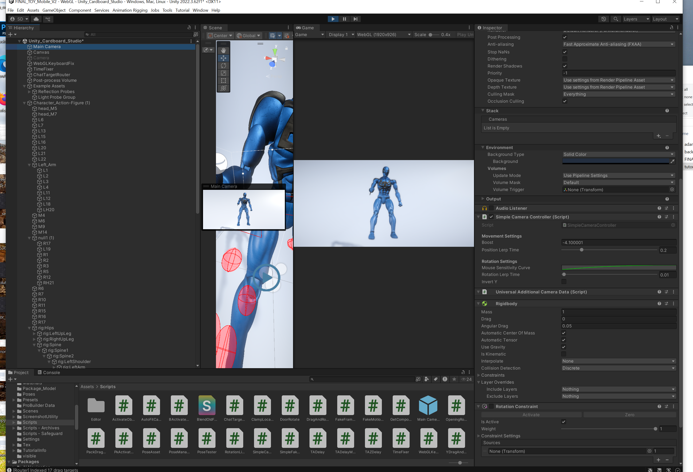</p>
<p><em><em>Figure 2. Main Camera selected, with the camera controller and physics/constraint components visible in the Inspector.</em></em></p>
</td>
</tr>
</tbody>
</table>

<table>
<tbody>
<tr>
<td width="51%">
<p align="center">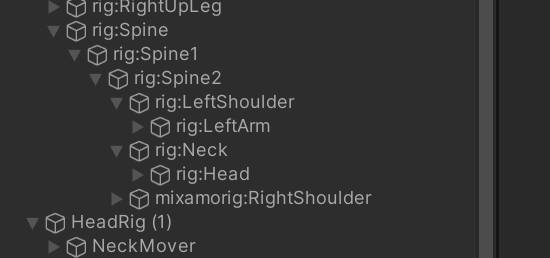</p>
<p><em><em>Figure 3. The project’s imported Generic skeleton branch, including spine, neck, head, and arm bones.</em></em></p>
</td>
<td width="49%">
<p><strong>Find the deforming skeleton</strong></p>
<p>Expand Character_Action-Figure (1) &gt; rig:Hips &gt; orig:Spine &gt; rig:Spine1 &gt; rig:Spine2.</p>
<p>The left arm continues through rig:LeftShoulder, rig:LeftArm, mixamorig:LeftForeArm, and mixamorig:LeftHand.</p>
<p>The neck/head branch is rig:Neck &gt; rig:Head; the right side uses equivalent mixed rig:/mixamorig: names.</p>
</td>
</tr>
</tbody>
</table>

#### 3. Test the supplied scene first

<ol start="6">
<li>Enter Play Mode and wait for the Game view to settle.</li>
<li>Test both an editor portrait view (1080 x 1920) and the custom WebGL view (1920 x 926). The drag sensitivity is normalized against Screen.width, so resolution affects the feel.</li>
<li>Tap or left-click a visible robot part, then drag. Release the pointer and verify that the part stops rotating.</li>
<li>On desktop, hold the right mouse button to look around. Use W/A/S/D to move, Q/E to move vertically, Shift to boost, and the mouse wheel to change the movement boost.</li>
<li>Watch Console for [Router] Indexed 17 drag targets. That message is expected from ChatTargetRouter with the current cube-tagged set.</li>
</ol>

<table>
<tbody>
<tr>
<td width="51%">
<p><strong>Portrait test profile</strong></p>
<p>Choose the custom 1080x1920 Game view size.</p>
<p>Use this to evaluate one-finger interaction and how much of the robot remains reachable vertically.</p>
<p>The project uses a CanvasScaler reference resolution of 1080x1920, although the current interactive robot controls are physics objects, not UI buttons.</p>
</td>
<td width="49%">
<p align="center">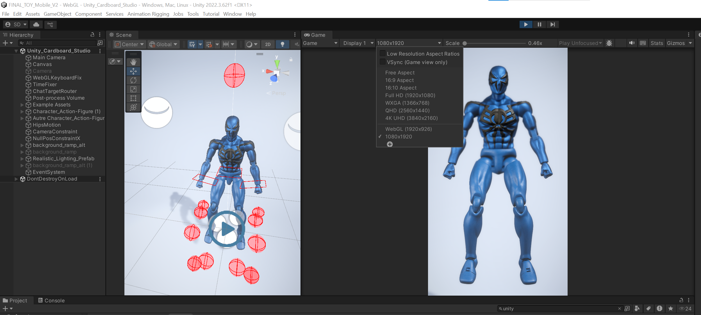</p>
<p><em><em>Figure 4. Portrait 1080x1920 selected in the Game view.</em></em></p>
</td>
</tr>
</tbody>
</table>

<table>
<tbody>
<tr>
<td width="51%">
<p align="center">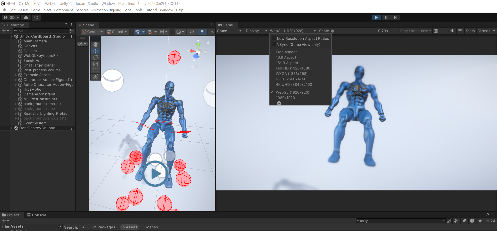</p>
<p><em><em>Figure 5. The custom WebGL 1920x926 Game view and the robot in a seated pose.</em></em></p>
</td>
<td width="49%">
<p><strong>WebGL test profile</strong></p>
<p>Choose WebGL (1920x926) to reproduce the authored browser-shaped Game view.</p>
<p>The script adds a WebGL-only sensitivity multiplier in a built browser player—not while running inside the Editor.</p>
<p>Compare this view with portrait before changing any per-part speed values.</p>
</td>
</tr>
</tbody>
</table>

<table>
<tbody>
<tr>
<td width="51%">
<p><strong>Baseline appearance</strong></p>
<p>Use this straight-on portrait pose as a quick visual baseline.</p>
<p>If the robot disappears, verify Main Camera is active and that Character_Action-Figure (1) is enabled.</p>
<p>If only gizmos disappear, remember that they are Scene view overlays and are not expected in Game view.</p>
</td>
<td width="49%">
<p align="center"></p>
<p><em><em>Figure 6. The clean runtime robot view without Scene gizmos.</em></em></p>
</td>
</tr>
</tbody>
</table>

#### 4. How the existing robot is rigged

<p>This project is a hybrid. It has a Generic bone hierarchy imported from action.fbx, an Animator and Rig Builder on Character_Action-Figure (1), a large Animation Rigging stack that drives bones from target transforms, and separate collider-bearing robot-part objects that the interaction scripts rotate directly.</p>

<p align="center">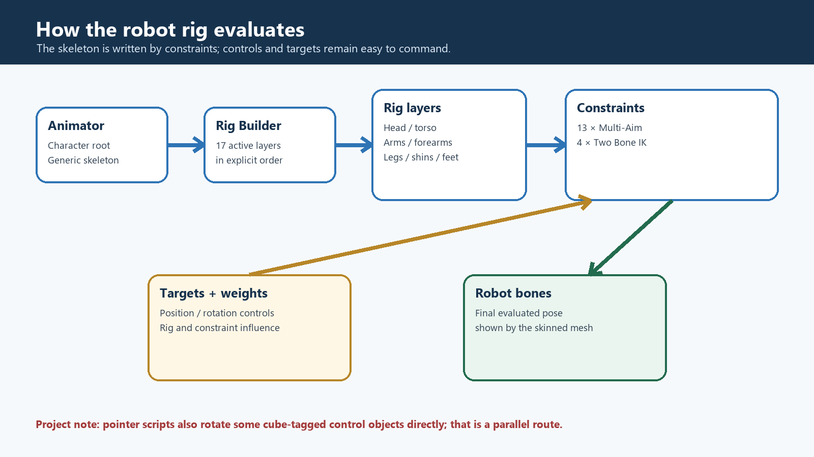</p>

<p align="center"><em><em>Diagram A. Project-specific rig evaluation: Animator to Rig Builder, rig layers, constraints, targets, and bones.</em></em></p>

##### Rig Builder layer order

<table>
<tbody>
<tr>
<th width="8%">
<p><strong>#</strong></p>
</th>
<th width="29%">
<p><strong>Rig layer</strong></p>
</th>
<th width="10%">
<p><strong>Rig weight</strong></p>
</th>
<th width="53%">
<p><strong>Constraint inside</strong></p>
</th>
</tr>
<tr>
<td width="8%">
<p>1</p>
</td>
<td width="29%">
<p><strong>HeadRig (1)</strong></p>
</td>
<td width="10%">
<p>0.4</p>
</td>
<td width="53%">
<p>Two Bone IK on NeckMover</p>
</td>
</tr>
<tr>
<td width="8%">
<p>2</p>
</td>
<td width="29%">
<p><strong>HipsRig (1)</strong></p>
</td>
<td width="10%">
<p>1.0</p>
</td>
<td width="53%">
<p>Two Bone IK on HipsMover</p>
</td>
</tr>
<tr>
<td width="8%">
<p>3</p>
</td>
<td width="29%">
<p><strong>TorsoRig (1)</strong></p>
</td>
<td width="10%">
<p>0.7</p>
</td>
<td width="53%">
<p>Multi-Aim, constraint weight 0.5</p>
</td>
</tr>
<tr>
<td width="8%">
<p>4</p>
</td>
<td width="29%">
<p><strong>ArmRRig</strong></p>
</td>
<td width="10%">
<p>1.0</p>
</td>
<td width="53%">
<p>Two Bone IK</p>
</td>
</tr>
<tr>
<td width="8%">
<p>5</p>
</td>
<td width="29%">
<p><strong>ForearmRRig</strong></p>
</td>
<td width="10%">
<p>0.7</p>
</td>
<td width="53%">
<p>Multi-Aim</p>
</td>
</tr>
<tr>
<td width="8%">
<p>6</p>
</td>
<td width="29%">
<p><strong>BicepRRig</strong></p>
</td>
<td width="10%">
<p>0.7</p>
</td>
<td width="53%">
<p>Multi-Aim</p>
</td>
</tr>
<tr>
<td width="8%">
<p>7</p>
</td>
<td width="29%">
<p><strong>ShoulderRRig</strong></p>
</td>
<td width="10%">
<p>0.7</p>
</td>
<td width="53%">
<p>Multi-Aim</p>
</td>
</tr>
<tr>
<td width="8%">
<p>8</p>
</td>
<td width="29%">
<p><strong>FootRRig</strong></p>
</td>
<td width="10%">
<p>0.7</p>
</td>
<td width="53%">
<p>Multi-Aim</p>
</td>
</tr>
<tr>
<td width="8%">
<p>9</p>
</td>
<td width="29%">
<p><strong>LegRRig</strong></p>
</td>
<td width="10%">
<p>0.7</p>
</td>
<td width="53%">
<p>Multi-Aim</p>
</td>
</tr>
<tr>
<td width="8%">
<p>10</p>
</td>
<td width="29%">
<p><strong>ShinRRig</strong></p>
</td>
<td width="10%">
<p>0.7</p>
</td>
<td width="53%">
<p>Multi-Aim</p>
</td>
</tr>
<tr>
<td width="8%">
<p>11</p>
</td>
<td width="29%">
<p><strong>ArmLRig</strong></p>
</td>
<td width="10%">
<p>1.0</p>
</td>
<td width="53%">
<p>Two Bone IK</p>
</td>
</tr>
<tr>
<td width="8%">
<p>12</p>
</td>
<td width="29%">
<p><strong>ForearmLRig</strong></p>
</td>
<td width="10%">
<p>0.7</p>
</td>
<td width="53%">
<p>Multi-Aim</p>
</td>
</tr>
<tr>
<td width="8%">
<p>13</p>
</td>
<td width="29%">
<p><strong>BicepLRig</strong></p>
</td>
<td width="10%">
<p>0.7</p>
</td>
<td width="53%">
<p>Multi-Aim</p>
</td>
</tr>
<tr>
<td width="8%">
<p>14</p>
</td>
<td width="29%">
<p><strong>ShoulderLRig</strong></p>
</td>
<td width="10%">
<p>0.7</p>
</td>
<td width="53%">
<p>Multi-Aim</p>
</td>
</tr>
<tr>
<td width="8%">
<p>15</p>
</td>
<td width="29%">
<p><strong>FootLRig</strong></p>
</td>
<td width="10%">
<p>0.7</p>
</td>
<td width="53%">
<p>Multi-Aim</p>
</td>
</tr>
<tr>
<td width="8%">
<p>16</p>
</td>
<td width="29%">
<p><strong>LegLRig</strong></p>
</td>
<td width="10%">
<p>0.7</p>
</td>
<td width="53%">
<p>Multi-Aim</p>
</td>
</tr>
<tr>
<td width="8%">
<p>17</p>
</td>
<td width="29%">
<p><strong>ShinLRig</strong></p>
</td>
<td width="10%">
<p>0.7</p>
</td>
<td width="53%">
<p>Multi-Aim</p>
</td>
</tr>
</tbody>
</table>

<p align="center"><em>Two additional Rig Builder slots are serialized as None. All listed slots are active.</em></p>

<table>
<tbody>
<tr>
<td width="51%">
<p align="center">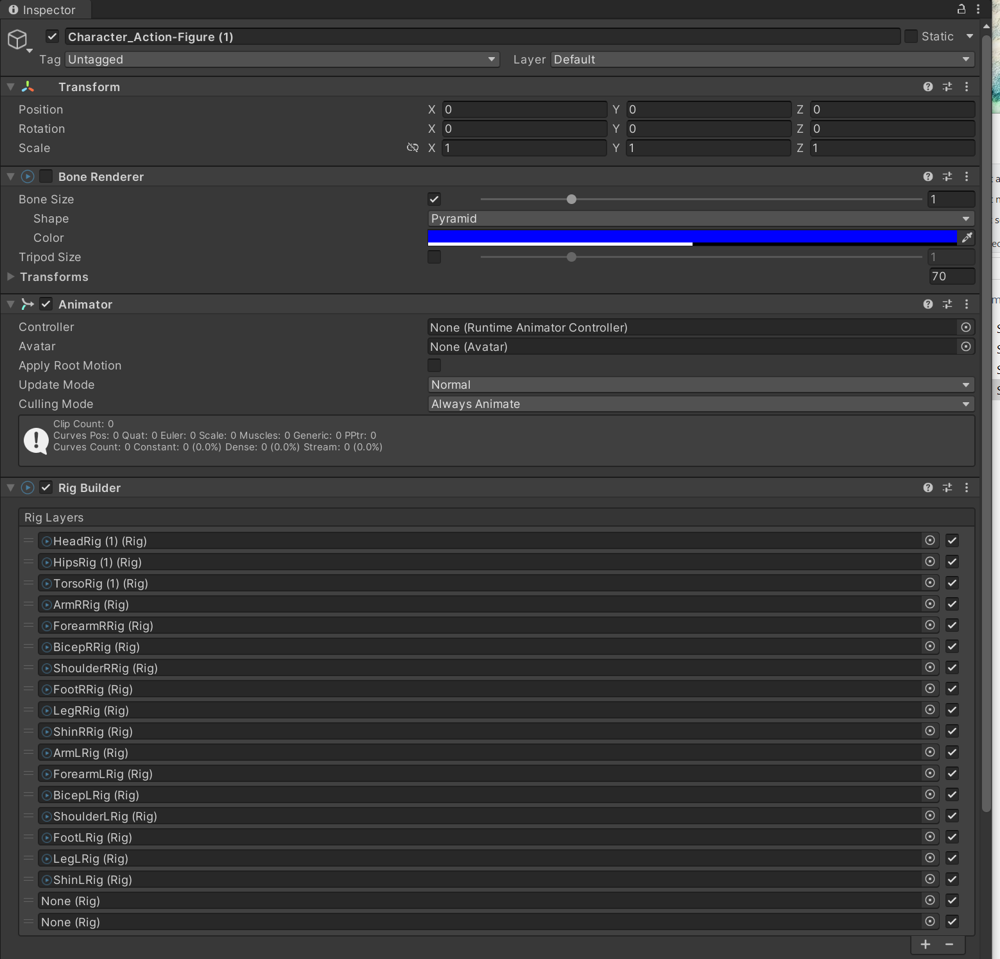</p>
<p><em><em>Figure 7. Character root with Animator and the long Rig Builder layer list.</em></em></p>
</td>
<td width="49%">
<p><strong>Inspect the root rig stack</strong></p>
<p>Select Character_Action-Figure (1).</p>
<p>Confirm Animator and Rig Builder are enabled.</p>
<p>The Animator intentionally has no controller and no avatar in this scene; Rig Builder still evaluates the transform hierarchy through its associated Animator.</p>
<p>Bone Renderer is present but disabled in the serialized scene; enable it only as an editor visualization aid.</p>
</td>
</tr>
</tbody>
</table>

<table>
<tbody>
<tr>
<td width="51%">
<p><strong>Understand targets and controls</strong></p>
<p>Each part rig contains a Target; many contain a child named HeadAim that holds the Multi-Aim Constraint.</p>
<p>The red spheres/capsules are collider gizmos for selectable robot pieces, not proof that every visible gizmo is an IK target.</p>
<p>ArmL/ArmR contain the strongest limb rigs; the other per-part rigs mainly aim individual bones toward targets.</p>
</td>
<td width="49%">
<p align="center">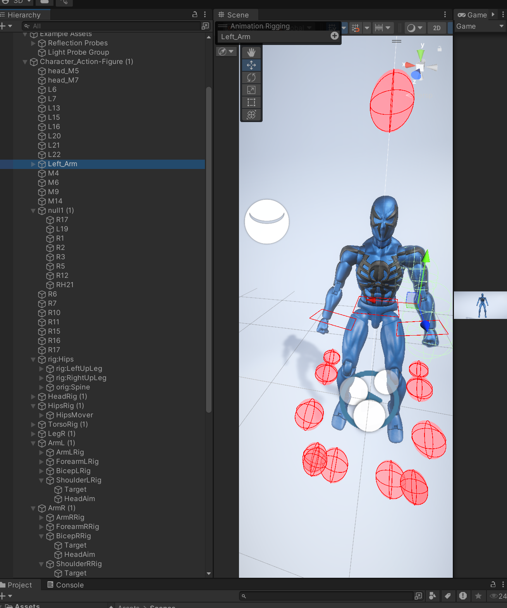</p>
<p><em><em>Figure 8. The full robot, collider gizmos, and per-part rig hierarchy.</em></em></p>
</td>
</tr>
</tbody>
</table>

##### Constraint details confirmed in the scene

<ul>
<li>Thirteen Multi-Aim Constraints drive torso, shoulders, upper arms, forearms, thighs, shins, and feet from one weighted target each.</li>
<li>Four Two Bone IK Constraints appear on the head, hips, left arm, and right arm. All have no Hint assigned.</li>
<li>The arm IK target position weight is 1 and rotation weight is 0.4; head uses 0.7 rotation weight; hips uses 1.0.</li>
<li>The torso Multi-Aim is limited to -15° through +15°. Limb aim limits range from ±30° to ±120°, with per-part offsets.</li>
</ul>

<blockquote>
<p><strong>VERIFIED DEFECT TO INSPECT  </strong>Both arm Two Bone IK constraints serialize Mid and Tip to the same hand transform instead of distinct forearm and hand transforms. The head and hips constraints also repeat a single transform for Root/Mid/Tip. That is not a valid textbook two-bone chain. Do not reproduce it when rigging a replacement robot; inspect it in the Editor before relying on IK behavior.</p>
</blockquote>

<p align="center">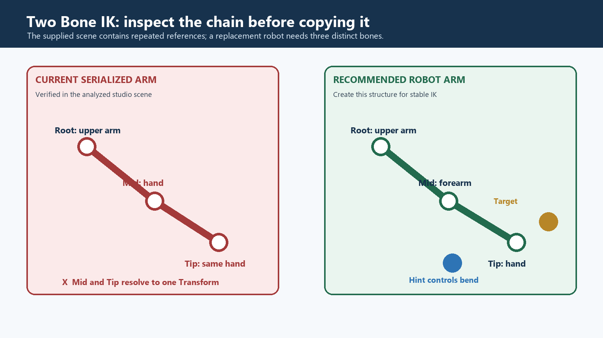</p>

<p align="center"><em><em>Diagram B. The serialized arm reference problem compared with a correct three-bone robot limb.</em></em></p>

#### 5. How desktop and mobile interaction works

<p>The runtime path is simple and mostly independent of Animation Rigging:</p>

<table>
<tbody>
<tr>
<td width="17%">
<p><strong>1</strong></p>
<p>Pointer down</p>
</td>
<td width="18%">
<p><strong>2</strong></p>
<p>Camera raycast</p>
</td>
<td width="19%">
<p><strong>3</strong></p>
<p>cube collider hit</p>
</td>
<td width="20%">
<p><strong>4</strong></p>
<p>isActive toggled</p>
</td>
<td width="26%">
<p><strong>5</strong></p>
<p>pointer delta rotates local Transform</p>
</td>
</tr>
</tbody>
</table>

<p align="center">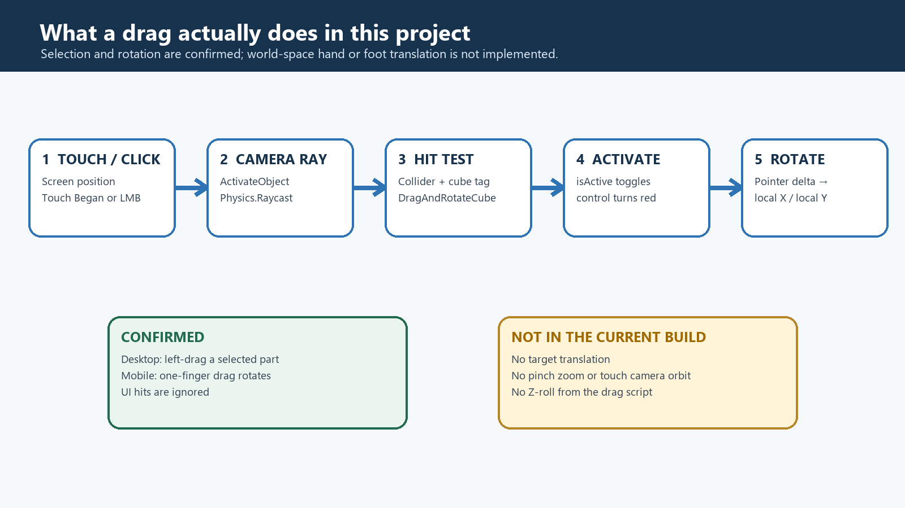</p>

<p align="center"><em><em>Diagram C. Confirmed pointer interaction path and the touch features that are not implemented.</em></em></p>

##### Selection: ActivateObject

<ul>
<li>Lives on Main Camera.prefab. On touch-began or left-mouse-down, it casts Physics.Raycast(Camera.ScreenPointToRay(pointerPosition)).</li>
<li>It ignores a pointer that EventSystem reports over UI.</li>
<li>It accepts all layers by default but requires the hit Transform to carry the cube tag.</li>
<li>It looks for DragAndRotateCube on the hit collider and toggles isActive.</li>
</ul>

##### Rotation: DragAndRotateCube

<ul>
<li>Requires a Collider. One-finger movement or held left-mouse movement produces a screen-space delta.</li>
<li>Vertical drag becomes local X pitch; horizontal drag becomes local Y yaw; Z roll is intentionally zero.</li>
<li>Effective speed = rotateSpeedModifier × width normalization × partSpeedMultiplier. A built WebGL player additionally uses webglBoost × webglPartScale.</li>
<li>Touch Ended/Canceled and mouse-up deactivate the part. Active controls turn red; idle controls are gray when a MeshRenderer is present.</li>
<li>maxDegreesPerFrame is zero on all confirmed instances, so no per-frame cap is active. Most tagged body parts use speed 0.45 or 0.65 and WebGL boost 2.2.</li>
</ul>

<table>
<tbody>
<tr>
<td width="51%">
<p align="center">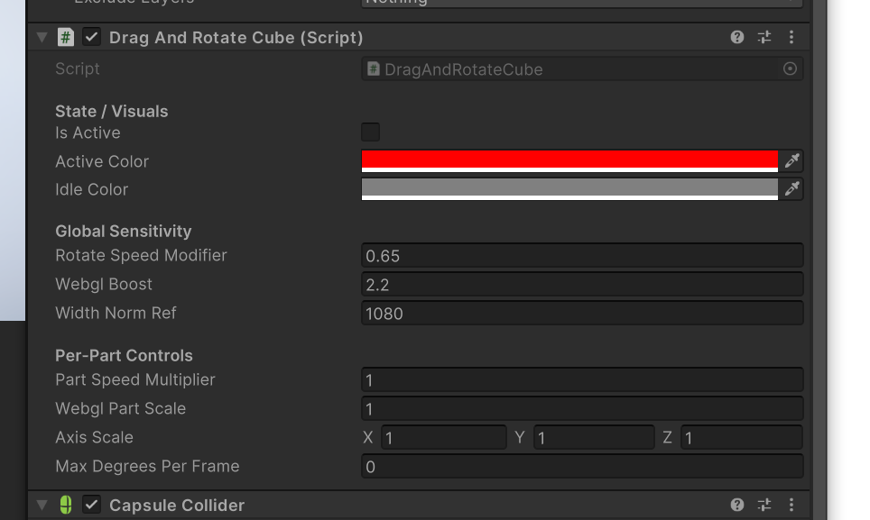</p>
<p><em><em>Figure 9. DragAndRotateCube and CapsuleCollider on an interactive part.</em></em></p>
</td>
<td width="49%">
<p><strong>A selectable part</strong></p>
<p>DragAndRotateCube is paired with a CapsuleCollider on many pieces.</p>
<p>The collider is what the camera ray hits; the script is what rotates the selected Transform.</p>
<p>Per-part sensitivity can soften or strengthen a control without changing the global algorithm.</p>
</td>
</tr>
</tbody>
</table>

<table>
<tbody>
<tr>
<td width="51%">
<p><strong>Sensitivity fields</strong></p>
<p>rotateSpeedModifier is the base pixel-to-degree multiplier.</p>
<p>widthNormRef defines the screen-width reference used by normalization.</p>
<p>axisScale can damp X or Y independently; the current script does not use Z for touch/mouse drag.</p>
<p>A zero maxDegreesPerFrame means uncapped rotation per frame.</p>
</td>
<td width="49%">
<p align="center">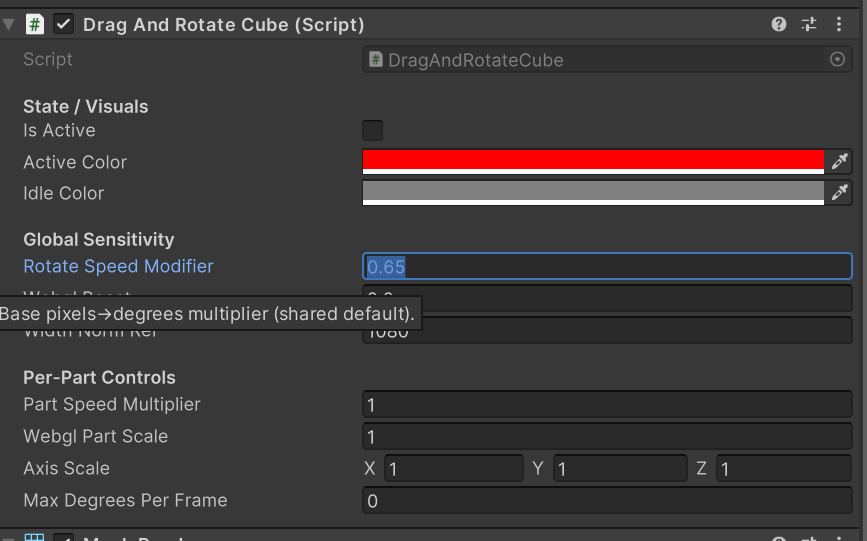</p>
<p><em><em>Figure 10. Close view of the DragAndRotateCube sensitivity and per-axis settings.</em></em></p>
</td>
</tr>
</tbody>
</table>

##### Desktop camera controls

<ul>
<li>Right mouse drag rotates Main Camera and locks the cursor while held.</li>
<li>W/A/S/D move forward/back/left/right; Q/E move vertically; Shift multiplies speed by 10; mouse wheel changes the exponential boost.</li>
<li>These bindings come from SimpleCameraController. Because the project is set to legacy input and does not list the Input System package, the legacy Input branch is the confirmed active path.</li>
</ul>

##### Mobile controls and limitations

<ul>
<li>Confirmed: one-finger tap selects a cube-tagged collider; one-finger movement rotates its Transform; finger release ends the interaction.</li>
<li>Confirmed: EventSystem + StandaloneInputModule exist, and ActivateObject checks whether the pointer is over UI before selecting a robot part.</li>
<li>Not implemented: touch translation of an IK target, pinch zoom, two-finger camera orbit, or touch camera movement.</li>
<li>YDragAndRotateCube and BActivateObject exist in Assets/Scripts but are not attached in this scene. They are not part of the confirmed runtime path.</li>
</ul>

<blockquote>
<p><strong>MEANING OF 'GRAB' AND 'MOVE' HERE  </strong>The existing project supports grabbing in the sense of selecting a collider and moving the pointer to rotate/pose that object. It does not convert touch movement into world-space target translation. To let users drag hands or feet through space, add a separate positional-target driver to the appropriate IK Target; the current script cannot provide that behavior.</p>
</blockquote>

#### 6. How scripts communicate with the rig

<p>There are two parallel control routes, and conflating them would be misleading.</p>

<table>
<tbody>
<tr>
<th width="23%">
<p><strong>Route</strong></p>
</th>
<th width="36%">
<p><strong>What writes</strong></p>
</th>
<th width="42%">
<p><strong>What the rig receives</strong></p>
</th>
</tr>
<tr>
<td width="23%">
<p><strong>Human pointer</strong></p>
</td>
<td width="36%">
<p>ActivateObject enables DragAndRotateCube; DragAndRotateCube writes the selected object’s local rotation.</p>
</td>
<td width="42%">
<p>No direct RigBuilder or constraint API call. Most cube-tagged objects are separate mesh/control pieces, not the serialized IK Targets.</p>
</td>
</tr>
<tr>
<td width="23%">
<p><strong>Chat/JS bridge</strong></p>
</td>
<td width="36%">
<p>ChatTargetRouter indexes all cube-tagged transforms and accepts list/add/set/euler/resetIndex JSON commands.</p>
</td>
<td width="42%">
<p>It writes localRotation directly on the named transform. This is bridge-ready, but it bypasses constraint weights and target fields.</p>
</td>
</tr>
<tr>
<td width="23%">
<p><strong>Animation Rigging</strong></p>
</td>
<td width="36%">
<p>RigBuilder evaluates 17 active Rig layers after Animator evaluation.</p>
</td>
<td width="42%">
<p>Two Bone IK and Multi-Aim jobs read their target transforms and write the skeleton’s constrained bones.</p>
</td>
</tr>
</tbody>
</table>

##### ChatTargetRouter API confirmed in code

<ul>
<li>list — logs indexed part names.</li>
<li>add or rotate — adds degrees on x, y, or z over an optional duration.</li>
<li>set — sets one local Euler axis to an absolute degree value.</li>
<li>euler — sets multiple local Euler values; unspecified axes are intended to remain unchanged.</li>
<li>resetIndex — rebuilds the cube-tag index.</li>
</ul>

<blockquote>
<p><strong>AI STATUS  </strong>No AI model, network client, speech layer, or JavaScript sender is present in the Unity project. The preserved HandleJSON method is an integration endpoint, not a complete AI system. 'AI-ready' therefore means that a future trusted controller can emit validated, structured commands to stable transform names.</p>
</blockquote>

#### 7. Rig a new robot character — video workflow adapted to this project

<blockquote>
<p><strong>VIDEO WORKFLOW  </strong>The referenced Brackeys video demonstrates a bone display, Rig Builder/Rig setup, Multi-Aim head/chest targets, separate arm rig layer, Two Bone IK, gizmo targets, Copy World Placement, target-offset choices, and runtime weight blending. The procedure below adapts those ideas to this project’s robot and package versions.</p>
</blockquote>

<p align="center">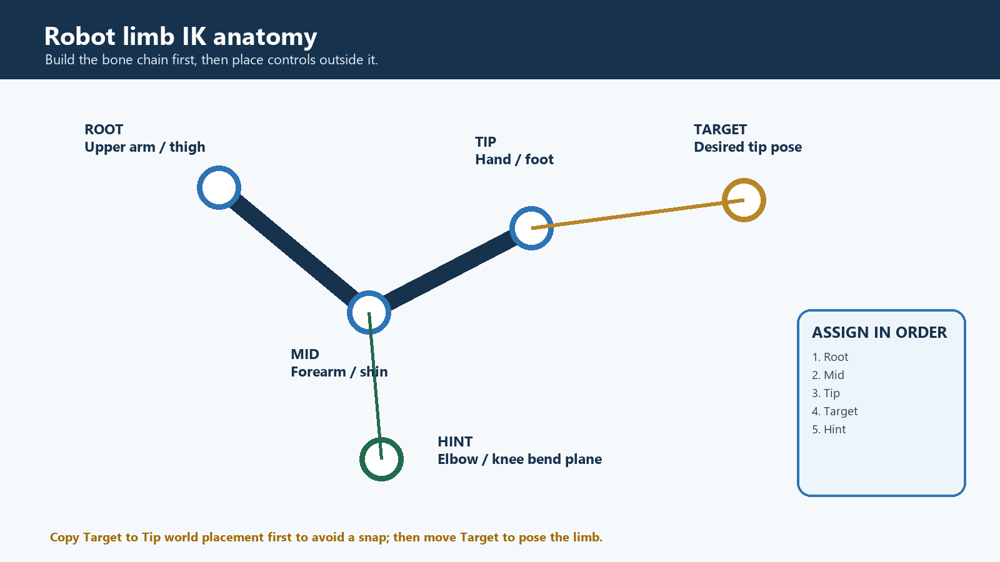</p>

<p align="center"><em><em>Diagram D. Two Bone IK anatomy for a robot arm or leg.</em></em></p>

<p align="center"><strong><strong>PHASE 01  /  MODEL PREPARATION</strong></strong></p>

##### <strong>Before Unity: prepare the robot</strong>

<ol>
<li><strong>In Blender, Maya, or another DCC, give the robot a real joint hierarchy.</strong> For each two-joint limb, provide three distinct transforms: upper segment, lower segment, and end effector—for example UpperArm_L &gt; Forearm_L &gt; Hand_L.</li>
<li><strong>Skin flexible parts to bones, or parent rigid shell pieces cleanly to the appropriate bones.</strong> Keep pivots on mechanical joint centers and orient local axes consistently.</li>
<li><strong>Export FBX with the skeleton and bind pose.</strong> Unity Animation Rigging adds runtime controls; it does not create missing bones or skin weights.</li>
</ol>

<p align="center"><strong><strong>PHASE 02  /  UNITY IMPORT</strong></strong></p>

##### <strong>Import and establish the Animator root</strong>

<ol start="4">
<li><strong>Import the FBX under Assets.</strong> In the Model Inspector &gt; Rig tab, use Generic for a robot that does not need Humanoid retargeting. Apply the setting.</li>
<li><strong>Leave Optimize Game Objects off while building and debugging the rig so every required Transform remains addressable.</strong> The supplied action.fbx is configured this way.</li>
<li><strong>Place the robot in a duplicate working scene.</strong> Put an Animator on the character root. A controller is optional for procedural-only tests, but the Animator component itself is required by Rig Builder.</li>
<li><strong>Open Window &gt; Package Manager and confirm Animation Rigging is installed.</strong> For parity with this project, use package 1.2.1 with Unity 2022.3.62f1.</li>
</ol>

<p align="center"><strong><strong>PHASE 03  /  RIG FOUNDATION</strong></strong></p>

##### <strong>Create the control-rig hierarchy</strong>

<ol start="8">
<li><strong>Select the character root and use Animation Rigging &gt; Rig Setup.</strong> Verify the result: the Animator root receives Rig Builder and a child rig object receives Rig.</li>
<li><strong>Optionally use Animation Rigging &gt; Bone Renderer Setup so bones are easier to inspect.</strong> This changes editor visualization, not runtime deformation.</li>
<li><strong>Create stable control groups under the rig, such as HeadRig, TorsoRig, ArmLRig, ArmRRig, LegLRig, and LegRRig.</strong> Use unique names because this project’s command router indexes by GameObject name.</li>
</ol>

<p align="center"><strong><strong>PHASE 04  /  AIM CONSTRAINTS</strong></strong></p>

##### <strong>Add head and torso aiming</strong>

<ol start="11">
<li><strong>Under HeadRig, create HeadAim and add Multi-Aim Constraint.</strong> Set Constrained Object to the head bone.</li>
<li><strong>Create a Target under HeadRig, place it in front of the robot, and add it as the first Source Object at weight 1.</strong></li>
<li><strong>Choose the head bone’s true local forward axis as Aim Axis.</strong> Set Up Axis and constrained axes, then set angular limits that fit the robot’s neck stops.</li>
<li><strong>For a torso follow, create a second Multi-Aim Constraint on a chest/spine bone.</strong> Reuse the same target if desired, but use a lower weight so the torso follows less than the head.</li>
</ol>

<p align="center"><strong><strong>PHASE 05  /  LIMB SOLVING</strong></strong></p>

##### <strong>Add correct Two Bone IK limbs</strong>

<ol start="15">
<li><strong>Under ArmLRig, create ArmLMover and add Two Bone IK Constraint.</strong></li>
<li><strong>Assign three different bones: Root = UpperArm_L, Mid = Forearm_L, Tip = Hand_L.</strong> Mid must be a child of Root, and Tip must continue beneath Mid.</li>
<li><strong>Create Target and Hint controls.</strong> Place Target at the hand’s current world position and rotation; the video demonstrates copying the tip’s world placement to avoid an immediate snap.</li>
<li><strong>Place Hint slightly in front of the elbow’s desired bend plane and assign it.</strong> Unlike the supplied scene’s constraints, a production robot arm should normally use a real Hint to stabilize the elbow.</li>
<li><strong>Choose Target Position Weight and Target Rotation Weight.</strong> Use Maintain Target Position/Rotation Offset only when you intentionally want to preserve the current difference between tip and target.</li>
<li><strong>Repeat for the right arm and both legs.</strong> For legs use Thigh &gt; Shin &gt; Foot; place knee hints forward and keep foot targets outside the deforming bone chain.</li>
<li><strong>Add each Rig object to Rig Builder in evaluation order.</strong> Put broader body adjustments before or after limb solvers deliberately, then test; order changes the result when several constraints write related bones.</li>
</ol>

<p align="center"><strong><strong>PHASE 06  /  RUNTIME CONTROLS</strong></strong></p>

##### <strong>Make controls interactive in this project</strong>

<ol start="22">
<li><strong>For rotational controls, add a visible or invisible collider to the intended control object, tag that same GameObject cube, and add DragAndRotateCube.</strong> The script checks the hit Transform itself; a tag only on a parent will not satisfy CompareTag on a child collider.</li>
<li><strong>Tune rotateSpeedModifier, widthNormRef, axisScale, and WebGL multipliers per control.</strong> Add ClampLocalRotation or a mechanical-limit component when a joint must stop safely.</li>
<li><strong>For hand/foot positional dragging, create a new position driver that raycasts onto a plane or depth surface and moves the IK Target in world space.</strong> Do not expect DragAndRotateCube to translate it.</li>
<li><strong>Scope ChatTargetRouter.root to the new character and expose stable, unique target names.</strong> Prefer commanding IK targets and Rig/constraint weights over directly writing deforming bones.</li>
<li><strong>Validate every incoming AI command: allowed target names, axis ranges, duration limits, and joint limits.</strong> Keep the command layer deterministic; an AI should request motion, while Unity enforces what is mechanically legal.</li>
</ol>

#### 8. Replace the existing robot

<ol start="11">
<li>Duplicate Unity_Adam_Studio.unity before editing. Keep the original scene as a working reference.</li>
<li>Import and place the new robot under a clean root with Animator. Match the old character’s world position and scale only after confirming the new model’s forward axis and units.</li>
<li>Build a fresh rig with the procedure in Section 7. Do not drag the old scene’s bone references into new constraints; every Root/Mid/Tip/Constrained Object must belong to the new Animator hierarchy.</li>
<li>Recreate targets, hints, colliders, cube tags, and interaction scripts. Copy numerical tuning only after testing—the same pixel delta can feel very different on a differently sized robot.</li>
<li>Update ChatTargetRouter.root to the new root and verify all names are unique. The current router keeps the first duplicate name it sees, so duplicates can route commands unpredictably.</li>
<li>Disable the old Character_Action-Figure (1) only after the new robot passes desktop, portrait, and WebGL tests. Then update camera framing and post-processing as needed.</li>
</ol>

#### 9. Test checklist

<ul>
<li>No Console compile errors, missing scripts, or PropertyStreamHandle errors.</li>
<li>Rig Builder has the intended Rig layers, no accidental None slots, and the correct order.</li>
<li>Every Two Bone IK uses distinct Root, Mid, and Tip transforms and every chain bends in the intended plane.</li>
<li>Targets begin at sensible positions; entering Play Mode does not snap limbs unexpectedly.</li>
<li>Head/torso aim uses the correct local aim axis and respects angular limits.</li>
<li>Every selectable collider is on the same GameObject that has cube tag and DragAndRotateCube.</li>
<li>One touch selects and rotates exactly one part; releasing stops it; UI taps do not select the robot.</li>
<li>Desktop camera controls do not interfere with left-drag posing.</li>
<li>1080x1920 and 1920x926 both feel controllable; a built WebGL player is tested separately from the Editor.</li>
<li>ChatTargetRouter lists the expected unique names and can execute a small, clamped test command.</li>
</ul>

#### 10. Common problems and fixes

<table>
<tbody>
<tr>
<th width="31%">
<p><strong>Symptom</strong></p>
</th>
<th width="69%">
<p><strong>Fix</strong></p>
</th>
</tr>
<tr>
<td width="31%">
<p><strong>A limb does not solve</strong></p>
</td>
<td width="69%">
<p>Check that Root, Mid, and Tip are three distinct transforms in one chain. The supplied scene’s arm Mid/Tip duplication is a concrete example of what to inspect.</p>
</td>
</tr>
<tr>
<td width="31%">
<p><strong>PropertyStreamHandle cannot be resolved</strong></p>
</td>
<td width="69%">
<p>Keep rigs and targets under the Animator hierarchy; disable Optimize Game Objects while debugging; rebuild Rig Builder after hierarchy changes.</p>
</td>
</tr>
<tr>
<td width="31%">
<p><strong>The limb snaps on Play</strong></p>
</td>
<td width="69%">
<p>Copy the tip’s world position/rotation to the target before enabling the constraint, or use Maintain Target Offset intentionally.</p>
</td>
</tr>
<tr>
<td width="31%">
<p><strong>Elbow or knee flips</strong></p>
</td>
<td width="69%">
<p>Assign a Hint and put it clearly on the desired bend side. The supplied scene has no hints, so it is more vulnerable to ambiguous bends.</p>
</td>
</tr>
<tr>
<td width="31%">
<p><strong>Head aims sideways</strong></p>
</td>
<td width="69%">
<p>Correct Aim Axis and Up Axis for the imported bone’s local orientation; do not assume world Z is local forward.</p>
</td>
</tr>
<tr>
<td width="31%">
<p><strong>Tap does nothing</strong></p>
</td>
<td width="69%">
<p>Verify Main Camera is active, the collider is hit by its culling/layer setup, the hit GameObject has tag cube, and DragAndRotateCube is on that same object.</p>
</td>
</tr>
<tr>
<td width="31%">
<p><strong>Drag rotates too fast in WebGL</strong></p>
</td>
<td width="69%">
<p>Lower per-part rotateSpeedModifier or webglPartScale; remember the WebGL boost compiles only in a non-Editor WebGL player.</p>
</td>
</tr>
<tr>
<td width="31%">
<p><strong>Part spins too far</strong></p>
</td>
<td width="69%">
<p>Set maxDegreesPerFrame and add joint clamps. Current tagged controls mostly have no cap, so this protection is not active by default.</p>
</td>
</tr>
<tr>
<td width="31%">
<p><strong>Touch cannot move a hand target</strong></p>
</td>
<td width="69%">
<p>That is expected: no positional touch driver exists. Implement a plane/depth-based target translator and move the IK Target, not the mesh shell.</p>
</td>
</tr>
<tr>
<td width="31%">
<p><strong>AI command moves the wrong part</strong></p>
</td>
<td width="69%">
<p>Use unique names, set ChatTargetRouter.root, rebuild the index, and reject unknown targets. The router is case-insensitive but keeps only the first duplicate name.</p>
</td>
</tr>
<tr>
<td width="31%">
<p><strong>Camera does not respond on mobile</strong></p>
</td>
<td width="69%">
<p>Also expected: SimpleCameraController exposes mouse/keyboard/gamepad navigation, not touch orbit or pinch zoom.</p>
</td>
</tr>
<tr>
<td width="31%">
<p><strong>Rig changes are invisible in Animation preview</strong></p>
</td>
<td width="69%">
<p>Confirm Rig Builder and Rig are enabled and use the Animation Rigging preview/inverse tools as appropriate; also verify constraint weight and Rig weight are above zero.</p>
</td>
</tr>
</tbody>
</table>

#### 11. What is confirmed—and what is not

##### Confirmed

<ul>
<li>Unity version, main scene path, package versions, build scene, URP, legacy input mode, tags, and relevant model-import settings.</li>
<li>The root Animator/Rig Builder, 17 active non-null Rig layers, 13 Multi-Aim Constraints, four Two Bone IK Constraints, targets, weights, and serialized chain references.</li>
<li>Main Camera prefab components, legacy desktop camera bindings, Physics.Raycast selection, cube tag filter, collider requirement, touch/mouse rotation mapping, WebGL sensitivity math, and router JSON commands.</li>
<li>All twelve supplied screenshots and their visible Inspector/Hierarchy/Game-view/application evidence.</li>
</ul>

##### Not confirmed / not present

<ul>
<li>The project’s original public download URL or license, because no repository metadata or README was supplied.</li>
<li>A completed AI service integration; only a local JSON command endpoint exists.</li>
<li>Touch-based world-space translation, pinch zoom, or two-finger orbit; the project code does not implement them.</li>
<li>Whether the degenerate Two Bone IK assignments are deliberate workarounds or mistakes; the serialized references are confirmed, but intent is not.</li>
</ul>

#### Sources

##### Project evidence (read-only)

<ul>
<li>ProjectSettings/ProjectVersion.txt</li>
<li>Packages/manifest.json</li>
<li>Packages/packages-lock.json</li>
<li>ProjectSettings/EditorBuildSettings.asset</li>
<li>ProjectSettings/ProjectSettings.asset</li>
<li>ProjectSettings/TagManager.asset</li>
<li>Assets/Scenes/Unity_Adam_Studio.unity (owner-confirmed current name; inspected snapshot: Assets/Scenes/Unity_Cardboard_Studio.unity)</li>
<li>Assets/Scripts/Main Camera.prefab</li>
<li>Assets/Scripts/ActivateObject.cs</li>
<li>Assets/Scripts/DragAndRotateCube.cs</li>
<li>Assets/Scripts/ChatTargetRouter.cs</li>
<li>Assets/Scripts/SimpleCameraController.cs</li>
<li>Assets/Scripts/ClampLocalRotation.cs</li>
<li>Assets/Scripts/AutoFitCapsule.cs</li>
<li>Assets/Characters/action.fbx.meta</li>
</ul>

##### External technical references

<p><a href="https://www.youtube.com/watch?v=Htl7ysv10Qs&amp;t=772s">Brackeys — Make your Characters Interactive! - Animation Rigging in Unity</a></p>

<p><a href="https://docs.unity3d.com/2022.3/Documentation/Manual/com.unity.animation.rigging.html">Unity 2022.3 manual — Animation Rigging package availability</a></p>

<p><a href="https://docs.unity3d.com/Packages/com.unity.animation.rigging@1.2/api/UnityEngine.Animations.Rigging.RigBuilder.html">Unity Animation Rigging 1.2 — RigBuilder API</a></p>

<p><a href="https://docs.unity3d.com/Packages/com.unity.animation.rigging@1.2/manual/constraints/TwoBoneIKConstraint.html">Unity Animation Rigging 1.2 — Two Bone IK manual</a></p>

<p><a href="https://docs.unity3d.com/Packages/com.unity.animation.rigging@1.2/manual/constraints/MultiAimConstraint.html">Unity Animation Rigging 1.2 — Multi-Aim Constraint manual</a></p>


---

## Adam 1.0: A Case Study

*Mar 30 '26 — Adam 1.0, Physical Intelligence Architecture*

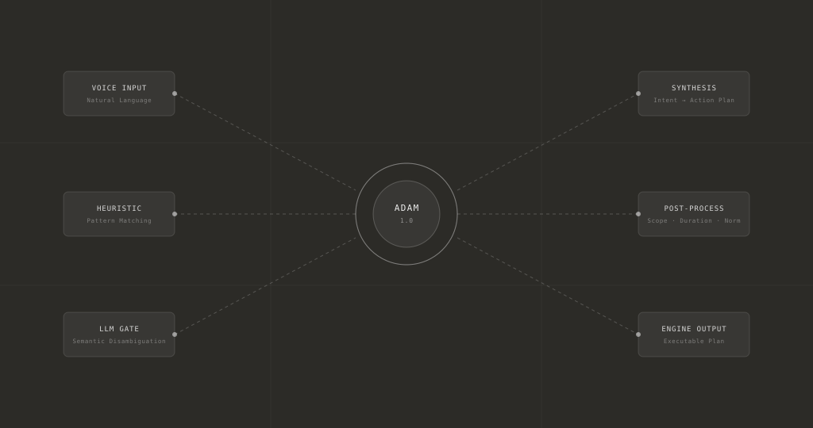

ADAM's architecture is organized around a single division of responsibility. The system's motion vocabulary is authored, finite, and calibrated by the engine. The language interface is fully open-ended, accepting any phrasing a speaker might use to describe movement — including figurative, qualified, and contextual language.

How ADAM routes arbitrary natural language through a tiered decision pipeline to produce authored, calibrated motion, and the engineering mechanisms behind each stage.

---

### Response Time

Every prompt entering the routing pipeline has a measurable cost. Stage 1 heuristic intercepts carry zero inference overhead — the engine returns a fully authored beat sequence with no language model call. Stage 2 language model gate calls add latency proportional to the model's time-to-first-token. The post-processing pipeline is deterministic and adds negligible time.

When a voice command triggers the routing pipeline, the end-to-end path from speech capture to engine-executable output is broken into overlapping stages. Speech-to-text conversion, heuristic evaluation, and — when required — language model inference run with the following measured contributions:

| Stage | Latency |
|---|---|
| STT | ~80ms |
| LLM Gate | ~180ms (when fired) |
| Post-processing | <5ms |
| **Total** | **<270ms w/ LLM** |

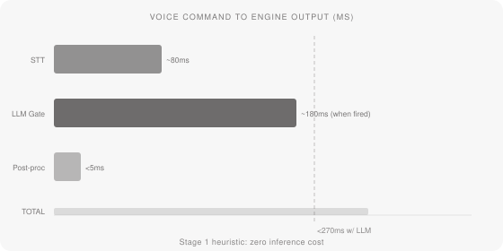

Stage 1 heuristic: zero inference cost.

**Routing path comparison:**

| Path | Latency |
|---|---|
| Full LLM path | ~270ms |
| Generic operator | ~85ms |
| Heuristic (Stage 1) | <5ms |

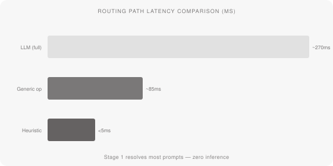

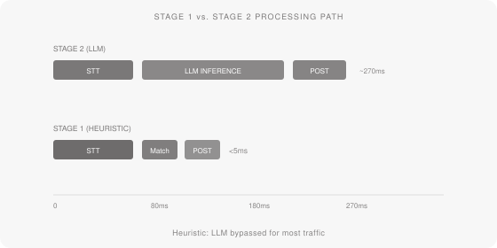

Stage 1 resolves most prompts with zero inference cost.

---

### Governing Principle

ADAM's architecture is organized around a single division of responsibility. The system's motion vocabulary is authored, finite, and calibrated by the engine. The language interface is fully open-ended, accepting any phrasing a speaker might use to describe movement, including figurative, qualified, and contextual language.

These two properties are made compatible by keeping the domains structurally separate. The language model reasons about what the speaker intends. The engine determines what that intention physically means, how it is executed, and at what calibration. The language model is a semantic selector. The engine is a physical authority. Neither domain bleeds into the other's.

The practical consequence is that the system handles "walk like you're carrying something heavy" or "move like you're trying not to wake anyone up" without a new motion primitive for either case. The language model identifies the closest existing motion in the authored vocabulary, and the engine executes it exactly as designed. This is a different architecture from systems that ask a language model to generate motion geometry directly, which couples language understanding and physical design into a single inference step.

---

### Articulation Model

The authored vocabulary is constrained by the physical structure of the rig. Each joint has a defined axis and a calibrated range. The engine resolves every motion command within those constraints — there is no freeform deformation, only authored part-and-joint relationships.

Motion is resolved through discrete articulated segments. Every motion in the system — authored or LLM-selected — reduces to one of two primitives:

- **Hold** — reaches a target position and remains there
- **Oscillate** — moves out and returns on every cycle

The language model's most consequential decision in Format B output reduces to a single binary semantic question: is this prompt describing a state or an action? The semantic answer maps directly to a mechanical choice, and the mechanical choice produces the correct visual communication to a viewer.

Adam is built from discrete articulated parts rather than a continuously deforming body. The assembled and exploded views below show that structure directly.

<table>
<tr>
<td width="50%" align="center">
<p><strong>ASSEMBLED</strong></p>
<a href="docs/media/prototypes/Assembled-Arm.mp4">
  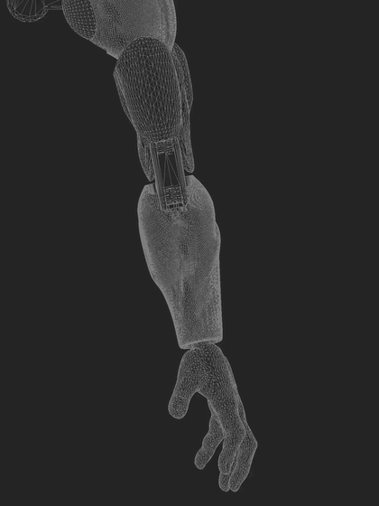
</a>
</td>
<td width="50%" align="center">
<p><strong>EXPLODED</strong></p>
<a href="docs/media/prototypes/Exploded-Arm.mp4">
  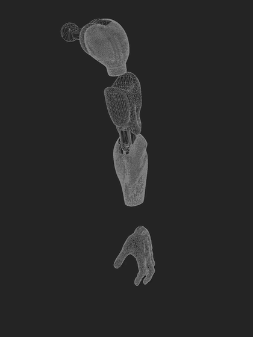
</a>
</td>
</tr>
</table>

**Figure 5.** Discrete articulated segments. Motion is resolved through authored parts and joints, not freeform deformation.

The same structure extends across the full figure.

<p align="center">
  <a href="docs/media/prototypes/Full-Body-Assembled.mp4">
    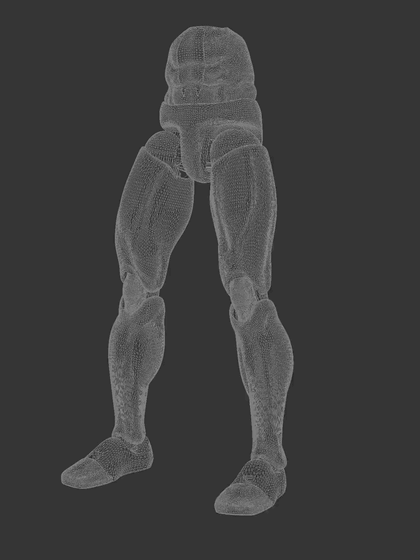
  </a>
</p>

**Figure 6.** The same articulation logic extends across the full figure, allowing motion to be routed through a constrained physical vocabulary.

---

### Routing Pipeline

Every prompt passes through a four-stage deterministic cascade. Each stage has defined authority and defined exit conditions. A decision made at an earlier stage cannot be overridden by a later one.

| Stage | Name | Description |
|---|---|---|
| Input | Natural language | Any spoken, typed, or text command |
| Stage 1 | Heuristic match | Pattern-matches against the authored motion vocabulary. A match exits immediately with zero inference cost. Outputs: `walk`, `run`, `brace`, etc. |
| Stage 2 | Language model | Fires only when Stage 1 returns null. Returns Format A or Format B JSON. Outputs: `Format B — direct` |
| Stage 3 | Synthesis | Merges overlays onto locomotion bases and applies fallback logic |
| Stage 4 | Calibration | Deterministic calibration: scope filtering, alternation sequencing, duration expansion, and normalization |
| Output | Action plan | Engine-executable plan |

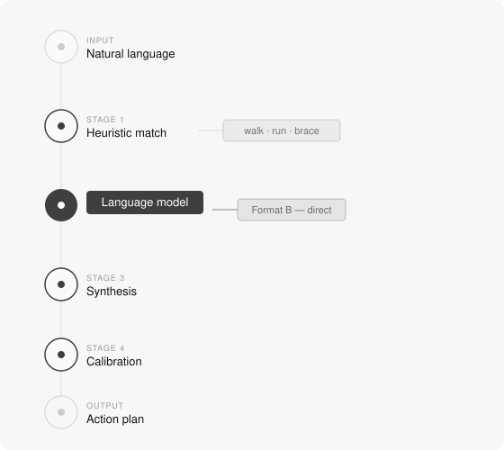

*Figure 1. Four-stage routing cascade. Stage 1 pattern-matches against the authored motion vocabulary — a match exits immediately with zero inference cost. Stage 2 fires only when Stage 1 returns null. Stage 3 merges overlays onto locomotion bases and applies fallback logic. Stage 4 applies deterministic calibration.*

---

### Motion Operator Primitives

All motion output reduces to two mechanical operators. Research on action perception identifies this division directly: the brain categorizes physical motion as either a state (a configuration held) or an event (a transition in progress). The two operators instantiate this perceptual distinction mechanically in the engine.

| Operator | Behavior |
|---|---|
| **Hold** | Reaches target. Stays there. |
| **Oscillate** | Moves out. Returns. Repeats. |

Every motion in the system — authored or LLM-selected — reduces to one of these two primitives.

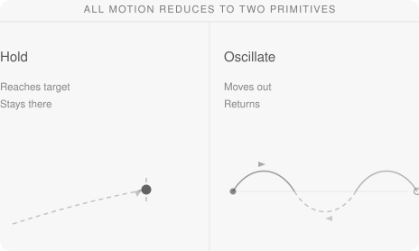

*Figure 2. Every motion in the system — authored or LLM-selected — reduces to one of two primitives. Hold commits to a position and remains. Oscillate moves out and returns, structurally, on every cycle.*

---

### Authored Vocabulary

The motion vocabulary is organized into four tiers. The tier structure encodes composition rules that the synthesis layer enforces at the beat level. A Tier 1.5 character overlay carries suppression and injection rules that activate specifically when merging onto a locomotion base — rules the language model never needs to reason about. The model selects from the vocabulary freely. The engine applies physical grammar downstream.

| Tier | Name | Type | Engine Behavior | Examples |
|---|---|---|---|---|
| T1 | Locomotion | Full gait — cyclic | Authored beat sequences, bilateral coupling, bypasses normalizer | `walk` `jog` `run` `sprint` `dance` `play` `fight` |
| T1.5 | Character Overlays | On T1 or standalone | Suppresses base arms, injects pose at beat 0, holds across cycle | `zombie` `injured` `proud` `scared` `drunk` |
| T2 | Postural-Reactive | One-shot or short-cycle | Cross-body state changes, authored timing preserved, normalizer bypassed | `alert` `cautious` `aim` `triumphant` `collapse` `recoil` `sneak` `brace` `search` `hesitate` `approach` `retreat` |
| T3 | Single-Region | Body-part targets | Multi-pass rig resolution, synonym index, side awareness enforced | `move/rotate arms` `move/rotate legs` `move/rotate forearms` `rotate head` `move body` `left/right variants` |

*T1.5 overlays branch from T1 — they layer onto locomotion or stand alone as stationary poses. T2 preserves authored timing and bypasses normalization. No combination of tier selections produces physically incoherent output.*

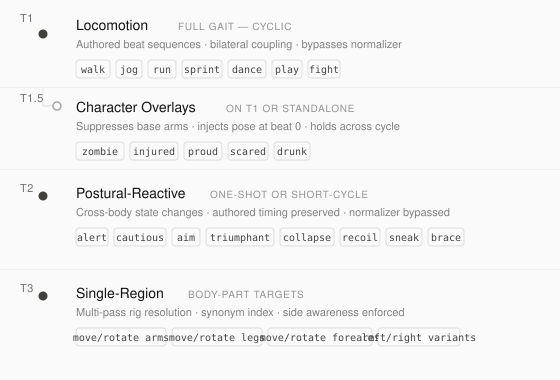

*Figure 3. The four-tier vocabulary. T1.5 overlays branch from T1 — they layer onto locomotion or stand alone as stationary poses. T2 preserves authored timing and bypasses normalization. No combination of tier selections produces physically incoherent output.*

---

### LLM Output Schema

The language model outputs one of two JSON structures. Format A handles expressive, figurative, and qualified language. Format B handles prompts that name a single universally recognizable mechanical pattern — swim, march, fly, wave one arm — where the action structure is fully determined by the verb and a body group.

Format B routes through the engine's native operator paths directly, bypassing the shaper, so the output carries calibrated operator values without modification. Format A feeds the full overlay and locomotion synthesis paths.

**Format A** — Expressive, figurative, qualified, overlay prompts

| Field | Required | Values |
|---|---|---|
| `phrases` | yes | 2–6 strings from authored vocabulary. At most one T1.5 overlay entry. |
| `mode` | | `"steps"` / `"sequential"` / `"parallel"` |
| `energy` | | `"low"` / `"med"` / `"high"` — scales amplitude |
| `tempo` | | `"fast"` / `"med"` / `"slow"` — scales timing |
| `pose` | | boolean, suppresses duration expansion |

```json
{"phrases":["walk","zombie"],"energy":"low","tempo":"slow","pose":false}
```

**Format B** — Single operator, single group, simple bilateral

| Field | Required | Values |
|---|---|---|
| `selection` | yes | `"hold/pose"` or `"oscillate"` — the primary semantic decision |
| `group` | yes | `"arms"` / `"forearms"` / `"legs"` / `"knees"` / `"head"` / `"hips"` |
| `laterality` | yes | `"together"` / `"alternate"` / `"left only"` / `"right only"` |
| `lead_side` | | Initiating side when laterality is `"alternate"` |
| `cycles` | | Integer 1–6, complete pattern repetitions |

```json
{"selection":"oscillate","group":"arms","laterality":"alternate","lead_side":"left","cycles":3}
```

*Format B routes through the engine's native operator paths with no shaper inflation. Format A is the correct default when the model is uncertain.*

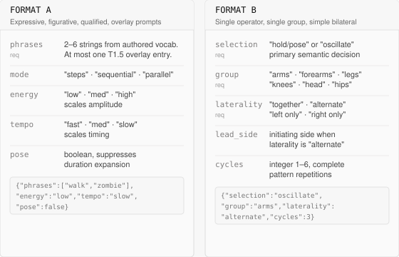

*Figure 4. The dual-format LLM output schema. Format B routes through the engine's native operator paths with no shaper inflation. Format A is the correct default when the model is uncertain.*

---

### Routing Guards

English surface structure produces specific ambiguities at routing boundaries. Four guards address the consequential ones, each introduced in response to an observable routing failure, each independently localized.

| Guard | Trigger | Effect |
|---|---|---|
| `Body-Noun Guard` | Operator verb, no body noun | Fails selectively — no body noun means no operator dispatch. Prompt reaches LLM and is routed as locomotion with qualifier. |
| `Walk-Overlay Guard` | Locomotion verb + overlay keyword | Bypasses plain-gait heuristic. LLM returns locomotion + overlay composition. Enables "walk like a zombie." |
| `Stationary-Simile Rule` | "Stand like" / "stand as if" | Verb determines route, not overlay term. "Stand like you're proud" results in a held pose. "Walk like you're proud" results in gait + overlay. |
| `Zombie Arm Suppression` | Zombie overlay on any locomotion base | Strips arm joints from the locomotion base before merge. Overlay arm pose injected at beat 0 only — holds across full cycle. |

*The body-noun guard's non-greedy design is the core mechanism for contextual locomotion prompts.*

---

### Synthesis Paths

Synthesis translates validated LLM intent into an engine-executable action plan by routing through existing authored paths. It generates no new motion.

**Locomotion + Overlay**

The locomotion plan is assembled from the Tier 1 authored family first. Zombie arm suppression strips arm joint entries if applicable. The Tier 1.5 overlay's body and head directives are then merged into the base beat structure. The overlay arm pose is injected at beat 0 only, which maintains continuous arm posture across all subsequent cycles without per-cycle re-injection logic.

**Stationary Overlay Fallback**

When the phrase list contains only a Tier 1.5 overlay with no locomotion base, the primary composition pass produces an empty action plan. Synthesis detects the empty plan and applies the fallback: the overlay becomes a standalone postural expression, `isPose=true` is set, and duration expansion is bypassed. The empty plan is the trigger — no special pre-classification needed.

**Targeted Operator Routing**

Format B group and laterality fields are translated into a target phrase string and routed through the existing engine phrase handler. Alternate laterality places lead-side joint actions in even steps and follow-side actions in odd steps, repeating across the declared cycle count. This path bypasses the shaper entirely, carrying native calibrated operator values from the outset.

---

### Post-processing Pipeline

| Stage | Function |
|---|---|
| `Scope Filter` | Builds allow/deny sets from body-region language. Runs before duration expansion — cycle count computed on retained actions only. |
| `Alternation Processor` | Splits into left, right, and neutral groups. Mirrors absent side by joint-ID substitution. Re-sequences into interleaved step indices. |
| `Duration Expander` | Computes cycle count as `ceil(targetSeconds / stepDuration)`. Mode-aware: parallel uses max duration; steps sums per-step maxima; sequential uses flat sum. |
| `Runtime Floor` | Floors each action timing to 0.05s on sequential non-pose plans. Aligns cycle-count computation with actual playback speed. |
| `Axis Normalization` | Validates axis values, fills missing degree and timing defaults. Every action fully specified before dispatch. |
| `Timing Normalizer` | Smooths variance across the action list. Applies 9-second global cap. Authored families bypass — their timing is preserved. |

*Duration expander is mode-aware: parallel, steps, and sequential plans require different cycle-count formulas. Runtime floor resolves the interaction between dense authored timing and duration expansion.*

---

### Regression Matrix

The routing pipeline's correctness is defined by a 22-case regression matrix. Every routing change is verified against it before deployment. The matrix targets the boundaries where incorrect routing produces the most visible communicative failure.

| Prompt | Route | Loco | Boundary |
|---|---|---|---|
| walk | `authored-family` | yes | Heuristic intercept, no LLM |
| jog | `authored-family` | yes | Sprint / jog / run family |
| move cautiously | `llm-format-a` | yes | Body-noun guard fails — LLM routes as loco + qualifier |
| move like you're trying not to be seen | `llm-format-a` | yes | Simile + travel — walk + sneak |
| walk like a zombie | `loco + overlay` | yes | Walk-overlay guard, arm suppression, beat-0 pose |
| run scared | `loco + overlay` | yes | Walk-overlay guard fires on run |
| stand proud | `stationary-overlay` | no | Overlay alone — stationary fallback, isPose=true |
| stand like you're scared | `stationary-overlay` | no | Stationary-simile rule fires, not loco+overlay |
| brace yourself | `authored-family` | no | Direct heuristic |
| move right arm | `generic-operator` | no | Body noun — operator dispatch, no LLM |
| rotate head | `generic-operator` | no | Rotate + body noun — 180° one-shot |
| move like something is wrong | `llm-format-a` | yes | No body noun — walk + cautious |
| stand like you're proud | `stationary-overlay` | no | Stationary-simile: proud alone, not walk + proud |
| move like a zombie | `loco + overlay` | yes | "move like" — guard fails — walk + zombie |

*The tricky-phrasing cases are the most diagnostic — they sit at the exact points where two routing paths appear equally valid.*

---

### System Invariants

1. **The engine owns all mechanical semantics.** Degree values, axis selection, timing, and joint resolution are determined exclusively by the engine. The language model selects from the authored vocabulary; the engine defines what every selection physically means.

2. **Authored families are fixed.** The heuristic layer, multi-body beat structures, and authored phrase definitions cannot be modified by the LLM path, synthesis layer, or post-processing pipeline.

3. **The shaper does not fire on authored plans.** Amplitude and timing inflation is bypassed for engine-authored families and targeted-operator plans. Authored motion executes with its designed calibration.

4. **At most one character overlay per composition.** Enforced by schema and synthesis logic. Two overlays in the same phrase list is undefined in the motion design space, excluded structurally.

5. **The post-processing pipeline is deterministic.** Identical inputs produce identical outputs. No stochastic element exists below the language model gate.

---

### Simplifying Multi-Touch Gestures with Unity's Input System

This section highlights the streamlined implementation of multi-touch gestures for rotating a figure in Unity, utilizing the Input System. Within the `Update()` method, the script monitors the boolean variable `isActive` to determine readiness for interaction. Upon activation, the figure changes color to signal readiness. It detects a single touch on the screen for rotation, controlled by `rotateSpeedModifier`. When the touch ends, the figure reverts to its default state, indicating inactivity. This approach efficiently enhances user interaction in 3D environments.

---

### Implications for Language-Controlled Physical Agents

The dominant paradigm in AI-controlled robotics frames the control problem as one of imitation. A human body is motion-captured at scale, a model learns to reproduce it, and when new behavior is needed, a human operator demonstrates or commands it directly via teleoperation. The robot's motion is, in this framing, always a derivative of human motion. The operator's hand is always, at some level, on the controls.

This framing transfers poorly to articulated systems that are designed objects rather than biomechanical replicas. A rig is not a human body. It has authored axes, calibrated ranges, and deliberate constraints. Those constraints are not deficiencies to engineer around. They are what gives the motion meaning. A 3D animator or technical director understands this from practice: a character moves within its vocabulary, and the vocabulary is what makes the movement readable. Remove the vocabulary and you remove the grammar. The output becomes physically possible but communicatively empty.

The engineering community building language-controlled physical agents has largely not absorbed this distinction. The result is systems that treat articulated motion as an underconstrained space to be filled by model output or direct operator input. Motion that is generated or commanded frame by frame does not read as autonomous. It reads as controlled, because it is. The operator's intention is legible in every frame.

ADAM proposes an inversion of this relationship. The physical vocabulary is authored, finite, and the system's own. The language model navigates it. The human describes an intention once, in natural language, and steps back. What the system does next comes from its own expressive library, not from an operator's hand or a model's approximation of captured human movement. The autonomy is architectural: when ADAM walks like a zombie or braces for impact, it is selecting from its own vocabulary. The motion belongs to the system. That distinction — between a system that is directed and a system that expresses — is the gap this architecture is designed to close.

---

### References

1. Jiang, B., et al. (2023). *MotionGPT: Human Motion as a Foreign Language.* NeurIPS 2023.
2. Tevet, G., et al. (2022). *Human Motion Diffusion Model.* arXiv:2212.04048.
3. Zhang, M., et al. (2023). *MotionDiffuse: Text-Driven Human Motion Generation with Diffusion Models.* IEEE TPAMI.
4. Ahn, M., et al. (2022). *Do As I Can, Not As I Say: Grounding Language in Robotic Affordances.* arXiv:2204.01691.
5. Zacks, J.M. and Tversky, B. (2001). *Event structure in perception and conception.* Psychological Bulletin, 127(1).
6. Lasseter, J. (1987). *Principles of traditional animation applied to 3D computer animation.* ACM SIGGRAPH, 21(4).
7. Schick, T., et al. (2023). *Toolformer: Language Models Can Teach Themselves to Use Tools.* NeurIPS 2023.
8. Beck, K. (2002). *Test-Driven Development: By Example.* Addison-Wesley.

---

## License

See [LICENSE](LICENSE) for details. Character and third-party assets remain the property of their respective owners.
